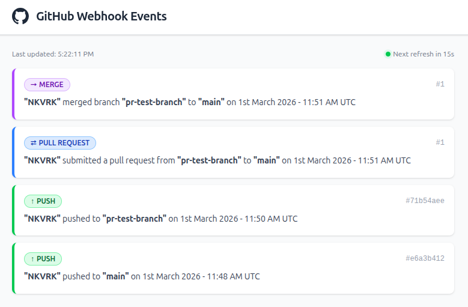

# GitHub Webhook Receiver

A Flask-based webhook receiver that captures **Push**, **Pull Request**, and **Merge** events from a GitHub repository, stores them in MongoDB Atlas, and displays them in a real-time React dashboard that polls every 15 seconds.

---

## Architecture

```
GitHub (action-repo)
    │
    │  Webhook (POST)
    ▼
Flask Backend (webhook-repo)
    │
    │  Store event
    ▼
MongoDB Atlas (github_events_db)
    │
    │  Poll every 15s
    ▼
React Frontend (webhook-repo/frontend)
```

| Component | Tech Stack |
|---|---|
| **Backend** | Python 3.12, Flask, Flask-PyMongo |
| **Database** | MongoDB Atlas (cloud) |
| **Frontend** | React 19, Vite 7, TailwindCSS v4 |
| **Tunnel** | ngrok (expose local server to GitHub) |

---

## Event Display Formats

| Action | Format |
|---|---|
| **PUSH** | `"{author}" pushed to "{branch}" on {timestamp}` |
| **PULL REQUEST** | `"{author}" submitted a pull request from "{from_branch}" to "{to_branch}" on {timestamp}` |
| **MERGE** | `"{author}" merged branch "{from_branch}" to "{to_branch}" on {timestamp}` |

Timestamps are displayed as: `1st March 2026 - 11:48 AM UTC`

---

## MongoDB Schema

| Field | Type | Description |
|---|---|---|
| `_id` | ObjectID | MongoDB auto-generated ID |
| `request_id` | string | Commit SHA (push) or PR number (PR/merge) |
| `author` | string | GitHub username of the actor |
| `action` | string | One of: `PUSH`, `PULL_REQUEST`, `MERGE` |
| `from_branch` | string | Source branch |
| `to_branch` | string | Target branch |
| `timestamp` | string | UTC datetime in ISO-8601 format |

---

## Prerequisites

- **Python** 3.12+
- **Node.js** 18+ and **npm** 9+
- **ngrok** (authenticated) — [https://ngrok.com](https://ngrok.com)
- **MongoDB Atlas** cluster with a connection string
- **GitHub account** with a repository to monitor (`action-repo`)

---

## Setup Instructions

### 1. Clone the Repository

```bash
git clone https://github.com/NKVRK/webhook-repo.git
cd webhook-repo
```

### 2. Backend Setup

```bash
# Create and activate a virtual environment
python3 -m venv venv
source venv/bin/activate

# Install Python dependencies
pip install -r requirements.txt
```

### 3. Configure MongoDB

Set the `MONGO_URI` environment variable (or edit the default in `app/__init__.py`):

```bash
export MONGO_URI="mongodb+srv://<user>:<password>@<cluster>.mongodb.net/github_events_db?retryWrites=true&w=majority"
```

### 4. Start the Flask Server

```bash
python run.py
```

The server runs at `http://127.0.0.1:5000`.

### 5. Frontend Setup

```bash
cd frontend

# Install Node.js dependencies
npm install

# Start the Vite dev server
npm run dev
```

The UI is available at `http://localhost:5173`.

> **Note:** The Vite dev server proxies `/webhook/*` requests to `http://127.0.0.1:5000` automatically.

### 6. Expose with ngrok

In a separate terminal:

```bash
ngrok http 5000
```

Copy the `https://...ngrok-free.dev` forwarding URL.

### 7. Configure GitHub Webhook

1. Go to your **action-repo** → **Settings** → **Webhooks** → **Add webhook**
2. Set the following:

| Setting | Value |
|---|---|
| Payload URL | `https://<your-ngrok-url>/webhook/receiver` |
| Content type | `application/json` |
| Events | Select **"Let me select individual events"** → check **Pushes** and **Pull requests** |
| Active | ✅ |

> **Note:** Merge events are automatically detected from Pull Request events (when a PR is closed with `merged: true`).

---

## API Endpoints

| Method | Endpoint | Description |
|---|---|---|
| `POST` | `/webhook/receiver` | Receives GitHub webhook payloads |
| `GET` | `/webhook/events/all` | Returns all stored events (initial load) |
| `GET` | `/webhook/events?after=<timestamp>` | Returns events after the given ISO-8601 timestamp (polling) |

---

## Project Structure

```
webhook-repo/
├── run.py                  # Flask entry point
├── requirements.txt        # Python dependencies (pinned)
├── app/
│   ├── __init__.py         # App factory, config, DB indexes
│   ├── extensions.py       # Shared PyMongo instance
│   └── webhook/
│       ├── __init__.py     # Blueprint package
│       └── routes.py       # Webhook receiver + polling API
├── frontend/
│   ├── index.html          # HTML entry point
│   ├── vite.config.js      # Vite config (TailwindCSS + proxy)
│   ├── package.json        # Node.js dependencies
│   └── src/
│       ├── main.jsx        # React entry point
│       ├── App.jsx         # Root component with header
│       ├── index.css       # TailwindCSS import
│       ├── components/
│       │   ├── EventList.jsx   # Polling logic + event list
│       │   └── EventCard.jsx   # Single event display card
│       └── utils/
│           └── formatDate.js   # Timestamp formatting utility
└── screenshots/
    └── test_results.png    # Test results screenshot
```

---

## Test Results

All three event types — **Push**, **Pull Request**, and **Merge** — have been tested successfully on the `action-repo` and captured by the webhook receiver:



---

## Key Design Decisions

- **Duplicate Prevention (3 layers):**
  1. MongoDB unique compound index on `(request_id, action)`
  2. Backend `find_one` check before insert
  3. Frontend de-duplication by `_id` + `after` timestamp filtering

- **Merge Detection:** GitHub sends merges as `pull_request` events with `action: "closed"` and `merged: true` — handled within the same webhook handler.

- **Error Handling:** Malformed payloads return HTTP 400 with a descriptive message instead of an unhandled 500 error. The frontend shows a red error banner when the backend is unreachable.

- **Performance:** MongoDB indexes on `(request_id, action)` and `timestamp` ensure fast queries even as the events collection grows.

---

## Codebase Walkthrough

See [Tour of codebase.md](Tour%20of%20codebase.md) for a detailed, file-by-file walkthrough of the entire project — covering the backend, frontend, and how they connect.

---

## Related Repository

- **[action-repo](https://github.com/NKVRK/action-repo)** — The monitored GitHub repository that triggers webhook events.